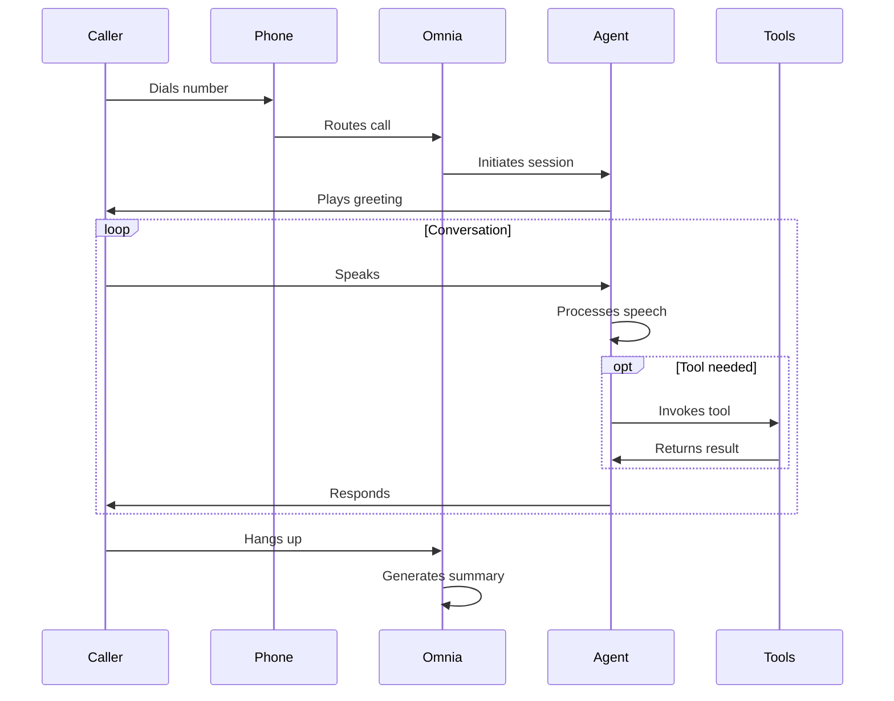

# Call Flow

This page explains how voice calls flow through the Omnia Voice platform.

## Inbound Call Flow

When someone calls a phone number assigned to your agent:

## WebSocket Call Flow

For browser-based or custom integrations:

<Steps>
  <Step title="Create call session">
    POST to `/calls/create` with your agent ID
  </Step>
  <Step title="Connect WebSocket">
    Connect to the returned WebSocket URL
  </Step>
  <Step title="Exchange audio">
    Send/receive PCM audio frames
  </Step>
  <Step title="Handle events">
    Process state changes and tool invocations
  </Step>
  <Step title="End call">
    Send `hang_up` message or close connection
  </Step>
</Steps>

## Call States

| State | Description |
|-------|-------------|
| `created` | Call session created, waiting for connection |
| `connecting` | WebSocket connecting |
| `connected` | Active call in progress |
| `ended` | Call has ended |

## Agent States

During a call, the agent transitions between states:

| State | Description |
|-------|-------------|
| `idle` | Waiting for input |
| `listening` | Processing speech input |
| `thinking` | Generating response |
| `speaking` | Playing audio response |

## Post-Call Processing

After a call ends:

1. **Transcription**: Full conversation transcript generated
2. **Summary**: AI-generated call summary
3. **Analytics**: Duration, tool usage, outcomes tracked
4. **Webhook**: `call.completed` event sent (if configured)

## Call Duration Limits

| Plan | Max Duration |
|------|-------------|
| Trial | 5 minutes |
| Starter | 30 minutes |
| Pro | 60 minutes |
| Enterprise | Unlimited |

## Next Steps

<CardGroup cols={2}>
  <Card title="WebSocket Integration" icon="plug" href="/guides/websocket">
    Build custom integrations
  </Card>
  <Card title="Webhooks" icon="webhook" href="/guides/webhooks">
    Receive call events
  </Card>
</CardGroup>
